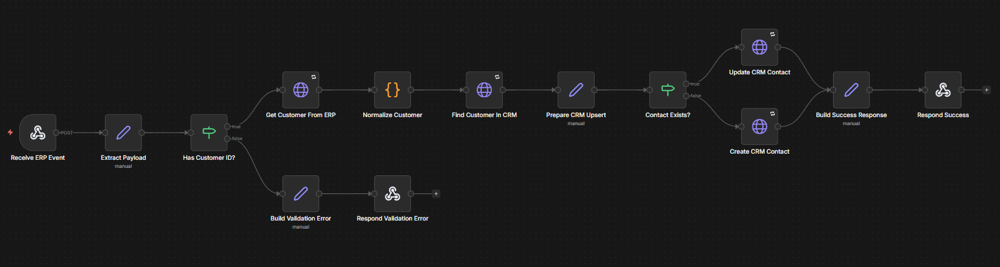

# ERP CRM Sync

## Overview

Workflow responsible for synchronizing customers between ERP and CRM systems.

## Features

- Receive webhook events
- Data validation
- Customer creation/update
- Error handling
- Execution logs

## Technologies

- n8n
- JavaScript
- REST APIs

## Workflow

