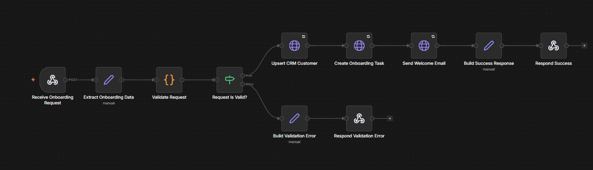

# n8n Onboarding Automation

## Overview

Workflow responsible for automating the customer onboarding process after a new signup or sales handoff.

## Features

- Receive onboarding requests through a webhook
- Validate required customer and contact data
- Create or update the customer in the CRM
- Create onboarding tasks for the internal team
- Send a welcome email to the customer
- Return a structured execution response

## Environment Variables

| Variable | Description |
|----------|-------------|
| `CRM_API_BASE_URL` | Base URL for the CRM API |
| `CRM_API_TOKEN` | API token used to authenticate CRM requests |
| `TASK_API_BASE_URL` | Base URL for the task/project management API |
| `TASK_API_TOKEN` | API token used to create onboarding tasks |
| `MAIL_API_BASE_URL` | Base URL for the transactional email API |
| `MAIL_API_TOKEN` | API token used to send welcome emails |

## Webhook Payload Example

```json
{
  "customer": {
    "name": "Acme Ltda",
    "email": "finance@acme.com",
    "document": "12345678000199",
    "plan": "business"
  },
  "owner": {
    "name": "Sales Owner",
    "email": "owner@example.com"
  }
}
```

## Workflow


