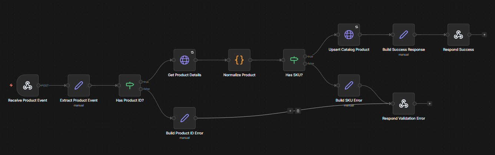

# n8n Product Sync

## Overview

Workflow responsible for synchronizing product catalog data from an ERP or commerce platform to external channels.

## Features

- Receive product change events through a webhook
- Validate required product data
- Fetch full product details from the source system
- Normalize SKU, pricing, inventory and publication status
- Upsert the product in the destination catalog
- Return a structured synchronization response

## Environment Variables

| Variable | Description |
|----------|-------------|
| `ERP_API_BASE_URL` | Base URL for the ERP/source catalog API |
| `ERP_API_TOKEN` | API token used to authenticate source requests |
| `CATALOG_API_BASE_URL` | Base URL for the destination catalog API |
| `CATALOG_API_TOKEN` | API token used to authenticate catalog requests |

## Webhook Payload Example

```json
{
  "eventId": "evt_123",
  "eventType": "product.updated",
  "productId": "prd_001"
}
```

## Workflow


